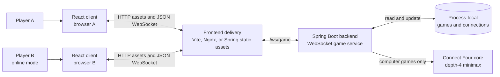
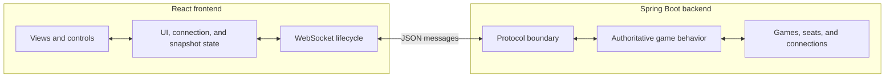
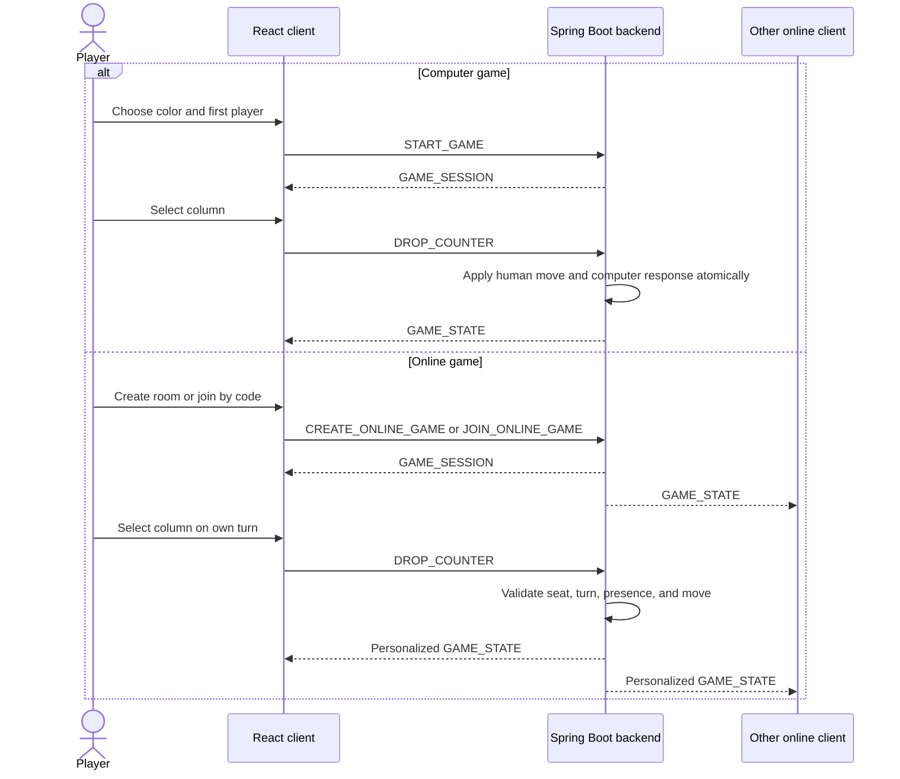
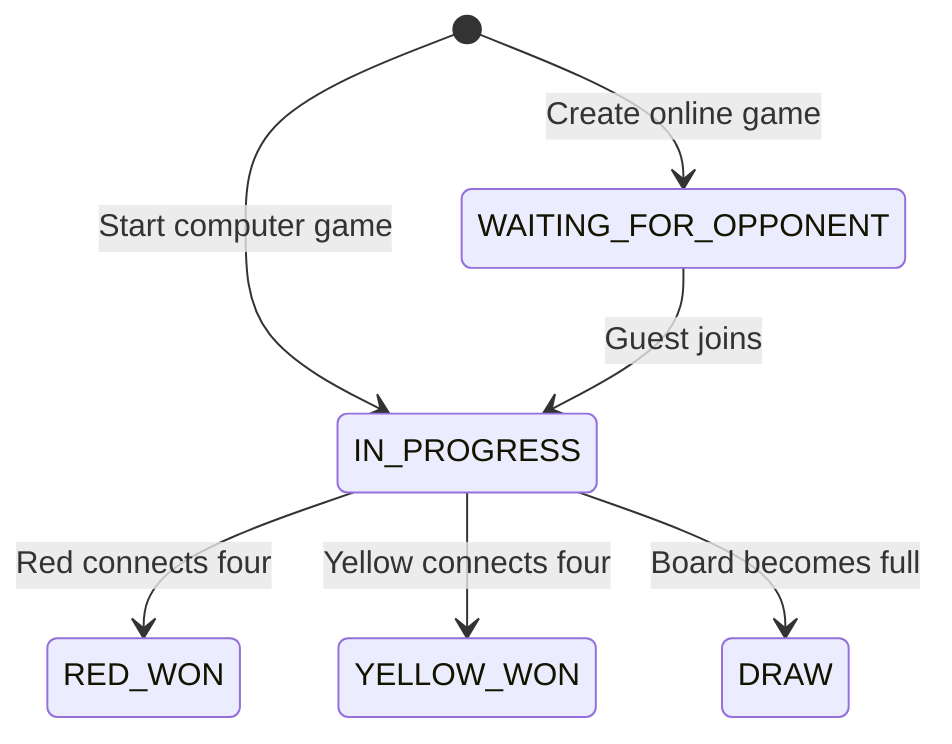
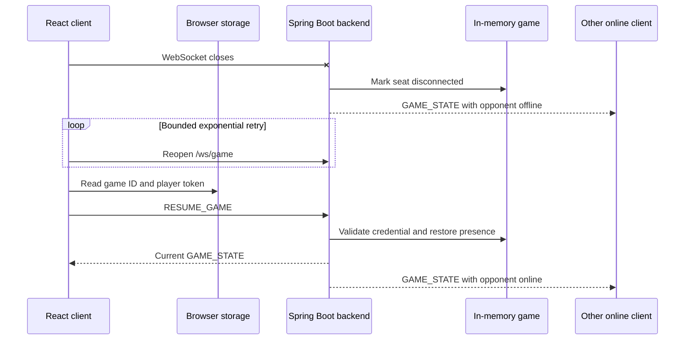

# Connect Four architecture

Connect Four consists of a React browser client and a Spring Boot backend that
communicate through a raw JSON WebSocket protocol. Players can challenge the
computer or create an online room for a second browser to join.

This document stays at the system boundary. Implementation details are covered
separately:

- [Backend design](backend-design.md)
- [Frontend design](frontend-design.md)
- [Spring configuration](spring-configuration.md)
- [Cloud deployment](cloud-deployment.md)

## Design principles

- **The backend is authoritative.** It decides whether commands are legal and
  owns boards, turns, results, player seats, and connection presence.
- **The frontend is a projection of server state.** It renders snapshots,
  collects player intent, manages connection UX, and never applies game rules.
- **The protocol is the system boundary.** The two applications share message
  meanings rather than implementation classes.
- **A game is process-local.** Sessions and credentials live in backend memory;
  there is no database or account system.
- **One game is updated serially.** Accepted commands produce an atomic state
  change before clients receive their next snapshot.

## System context



The delivery layer changes by environment, but the browser always connects to
`/ws/game` on its current origin. Development and container proxies forward
that path to Spring Boot; the cloud image serves both assets and WebSockets
from the same process.

## System responsibilities



| Boundary | Responsibilities |
| --- | --- |
| React client | Render setup and game views, collect commands, disable unsafe input, animate snapshots, persist the resume credential, and reconnect |
| Spring Boot backend | Validate commands and credentials, own game rules and lifecycle, manage seats and presence, invoke the computer player, and publish personalized snapshots |
| WebSocket protocol | Carry commands, snapshots, session credentials, abandonment notices, and structured errors |
| In-memory state | Hold active games, online room lookup, player credentials, and active socket ownership |
| Delivery layer | Serve browser assets and route WebSocket upgrades to the backend |

Neither client can modify another client's state directly. In online mode both
browsers send commands to the same authoritative game, and the backend
broadcasts the resulting view to each seat.

## State ownership

| State | Authoritative owner | Client behavior |
| --- | --- | --- |
| Board, mode, status, starting color, and current turn | Backend game session | Replace the rendered snapshot when the server sends an update |
| Online seats, room code, and connection presence | Backend game session | Display room and opponent state; pause input while an opponent is offline |
| Player credential | Backend issues and validates it | Store `{gameId, playerToken}` in browser `localStorage` for resume |
| Active socket for each seat | Backend connection state | Treat a replaced connection as no longer authoritative |
| Setup selections and temporary UI feedback | React client | Keep only for the current browser page |
| Animation bookkeeping | React client | Affect presentation only, never game legality |

The room code is an invitation identifier, while the private player token is a
bearer credential for one seat. Browser storage contains no authoritative board
or turn data.

## WebSocket protocol

Every message uses an envelope with a string `type` and a `payload` object.

### Client commands

| Command | Purpose |
| --- | --- |
| `START_GAME` | Start a human-versus-computer game |
| `CREATE_ONLINE_GAME` | Create an online room and claim the host seat |
| `JOIN_ONLINE_GAME` | Claim the remaining seat using a room code |
| `RESUME_GAME` | Reclaim a seat using a game ID and player token |
| `DROP_COUNTER` | Request a move in a zero-based column |
| `ABANDON_GAME` | Leave and remove the current game |

### Server messages

| Message | Purpose |
| --- | --- |
| `GAME_SESSION` | Return a newly issued player token and initial game snapshot |
| `GAME_STATE` | Replace the client's current personalized snapshot |
| `GAME_ABANDONED` | Tell one or both clients that the game was removed |
| `ERROR` | Report a structured recoverable or non-recoverable failure |

A game snapshot carries the mode, board, status, the receiving player's color,
starting color, current turn, room information, opponent presence, and an
optional computer-move animation hint. Online snapshots are personalized so
each browser sees the same game from its own seat.

The Java and TypeScript message models must evolve together. See the detailed
guides for their class and component ownership.

## Gameplay flow



Computer games return one snapshot after the human and AI portions of the turn.
Online games apply one counter at a time and broadcast the result to both seats.
Red always starts an online game, regardless of whether red belongs to the host
or guest.

## Game lifecycle



Disconnecting does not change the game status. It changes presence and pauses
online play until the missing seat resumes. Completed games remain available
for resume until a player abandons them or the backend process stops.

## Reconnection and replacement



The latest valid resume replaces the previous socket for that seat. A replaced
client stops retrying so two tabs do not compete indefinitely. If the backend
no longer has the game or rejects the token, the frontend clears the saved
credential and returns to setup.

## Consistency and failure model

Commands for one game are serialized by the backend. A client disables move
controls while awaiting a response, but this is only a usability measure; the
backend validates every command independently.

Failures fall into five system-level categories:

| Category | System behavior |
| --- | --- |
| Invalid message or move | Reject without changing accepted game state; keep the connection usable when recovery is possible |
| Invalid room or credential | Do not claim a seat; clear stale saved credentials when the session cannot be resumed |
| Temporary connection loss | Preserve the game, disable controls, retry, and resume from the backend snapshot |
| Explicit abandonment | Remove the game and notify every connected participant |
| Unexpected backend failure | Return a generic non-recoverable error without exposing internals |

These guarantees apply within one backend process. Durable state and
multi-replica coordination are outside the current architecture.

## Runtime topology

```mermaid
flowchart TB
    subgraph Native["Native development"]
        DevBrowser["Browser<br/>localhost:5173"]
        Vite["Vite dev server"]
        DevBackend["Spring Boot<br/>localhost:8080"]
        DevBrowser --> Vite
        Vite -->|"proxy /ws/game"| DevBackend
    end

    subgraph Compose["Docker Compose"]
        DockerBrowser["Browser<br/>localhost:3000"]
        Nginx["Frontend container<br/>Nginx and React assets"]
        DockerBackend["Backend container<br/>Spring Boot"]
        DockerBrowser --> Nginx
        Nginx -->|"internal /ws/game proxy"| DockerBackend
    end

    subgraph Cloud["Cloud deployment"]
        PublicBrowser["Browser"]
        Combined["Single Spring Boot service<br/>React assets and /ws/game"]
        PublicBrowser --> Combined
    end
```



Native development optimizes feedback, Compose mirrors separate frontend and
backend containers, and the cloud image combines both artifacts so WebSocket
state and HTTP traffic reach the same process.

## Running locally

With Java 21 and Node.js 24 or newer, start the backend:

```bash
cd backend
./mvnw spring-boot:run
```

Start the frontend in another terminal:

```bash
cd frontend
npm ci
npm run dev
```

Open `http://localhost:5173`. Test online play with separate browser storage
contexts so each player has a different saved credential.

Alternatively, from the repository root:

```bash
docker compose up --build
```

Open `http://localhost:3000`. Stop the containers with:

```bash
docker compose down
```

## Current boundaries

- Games, rooms, credentials, and presence disappear when the backend process
  stops, sleeps, or is redeployed.
- One backend process is authoritative; horizontal scaling would require shared
  state, distributed coordination, broadcasting, and connection-aware routing.
- There is no account system, database, matchmaking, chat, spectator mode,
  rematch flow, or durable match history.
- Public deployment details and free-service behavior are documented in
  [Cloud deployment](cloud-deployment.md).
