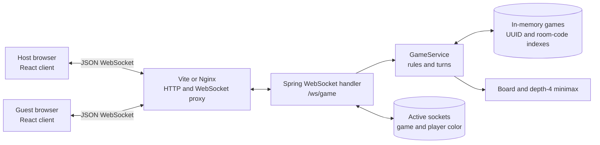
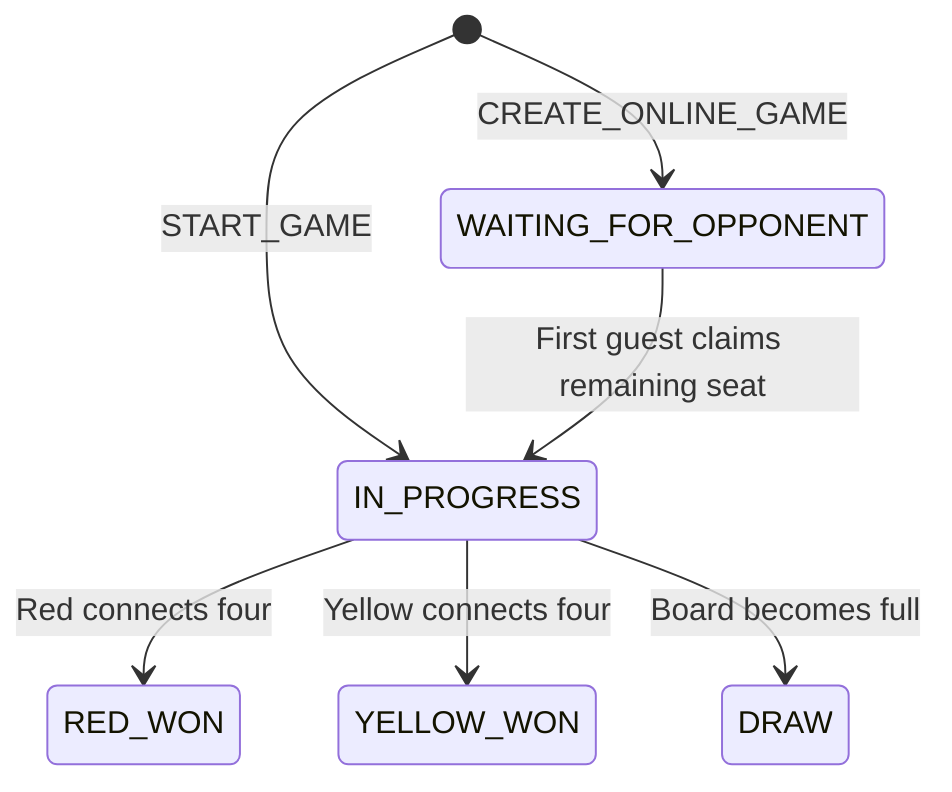
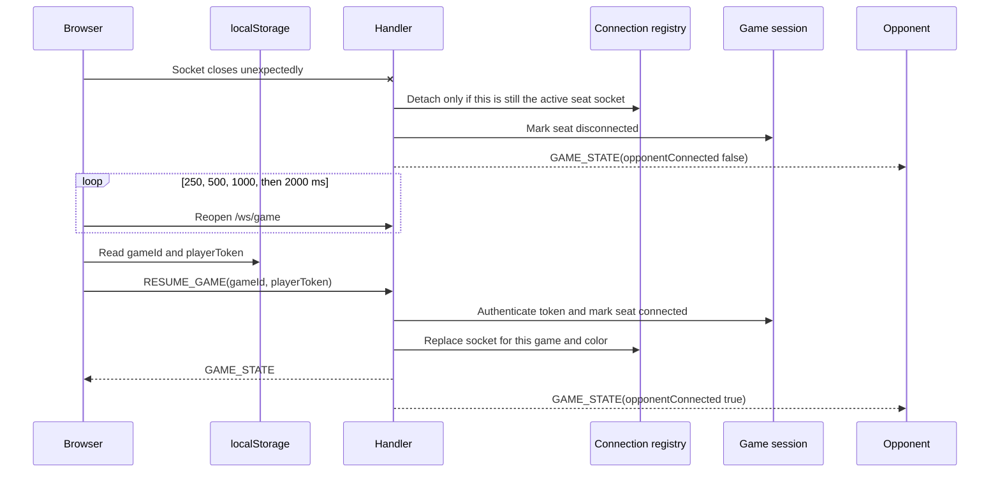

# Connect Four architecture

Connect Four is one React client, one Spring Boot process, a raw JSON WebSocket
protocol, and process-local game state. It supports human-versus-computer and
room-based online play. The backend is authoritative; clients render
personalized snapshots and never decide whether a move is legal.

Related guides:

- [Backend design](backend-design.md)
- [Frontend design](frontend-design.md)
- [Spring configuration](spring-configuration.md)
- [Cloud deployment](cloud-deployment.md)

## System context



The AI is used only in `COMPUTER` games. An `ONLINE` command applies one
counter, then broadcasts a seat-specific state to both players.

## Component responsibilities

- `App` owns setup choices and derives whether board input is enabled.
- `GameSetup` renders computer/create/join forms and normalizes room-code input.
- `GameBoard` renders server snapshots and applies presentation-only drop
  animation.
- `useGameSocket` owns the browser socket, pending-command state, reconnection,
  and the saved player credential.
- `GameWebSocketHandler` validates envelopes, binds sockets to seats, dispatches
  commands, broadcasts state, and translates failures.
- `GameService` owns room creation, seat assignment, authentication, game rules,
  turn changes, presence, abandonment, and snapshot conversion.
- `InMemoryGameRegistry` indexes sessions by UUID and online games by room code.
- `GameConnectionRegistry` stores the current socket for each `(gameId, color)`.
- `Board` and `Computer` preserve counter stacking and minimax behavior.

## State ownership

| State | Owner | Lifetime |
| --- | --- | --- |
| Board, mode, status, turn, seats, tokens, room code, and presence | Backend `GameSession` | Until explicit abandonment or process restart |
| UUID-to-session and room-code-to-UUID indexes | `InMemoryGameRegistry` | Process-local only |
| Active socket for each player seat | `GameConnectionRegistry` | Until disconnect, replacement, or abandonment |
| Latest personalized `GameState` | React `useGameSocket` | Replaced by each accepted server snapshot |
| `{gameId, playerToken}` resume credential | Browser `localStorage` under `connect-four.game-session` | Until abandonment or an invalid/missing session response |
| Setup mode, create/join choice, colors, room input, and copy feedback | React `App` | Current page lifetime |

Player tokens act as bearer credentials for one seat. They and the room state
are held in memory; there is no database or account system. A room code lets the
first guest claim the unoccupied seat but does not replace the private token
used for reconnection.

## WebSocket protocol

Every message is an envelope with a string `type` and a `payload`. Client
commands are:

```ts
{ type: 'START_GAME', payload: { humanColor, firstPlayer } }
{ type: 'CREATE_ONLINE_GAME', payload: { hostColor } }
{ type: 'JOIN_ONLINE_GAME', payload: { roomCode } }
{ type: 'RESUME_GAME', payload: { gameId, playerToken } }
{ type: 'DROP_COUNTER', payload: { column } }
{ type: 'ABANDON_GAME', payload: {} }
```

`humanColor` and `hostColor` are `RED | YELLOW`; `firstPlayer` is
`HUMAN | COMPUTER`; `column` is zero-based. The server trims and uppercases
room codes. The browser additionally removes non-alphanumeric characters and
limits input to six characters.

Server messages are:

```ts
{ type: 'GAME_SESSION', payload: { playerToken, game } }
{ type: 'GAME_STATE', payload: game }
{ type: 'GAME_ABANDONED', payload: { reason: 'YOU_LEFT' | 'OPPONENT_LEFT' } }
{ type: 'ERROR', payload: { code, message, recoverable } }
```

`GAME_SESSION` is returned only when a computer game or online seat is first
created or claimed; the client stores its token. A successful `RESUME_GAME`
returns `GAME_STATE` because the client already holds the token. Online joins,
moves, presence changes, and resumes also send `GAME_STATE` broadcasts to the
other connected seat.

The generalized snapshot is:

```ts
type GameState = {
  gameId: string
  mode: 'COMPUTER' | 'ONLINE'
  board: ('EMPTY' | 'RED' | 'YELLOW')[][]
  status:
    | 'WAITING_FOR_OPPONENT'
    | 'IN_PROGRESS'
    | 'RED_WON'
    | 'YELLOW_WON'
    | 'DRAW'
  yourColor: 'RED' | 'YELLOW'
  startingColor: 'RED' | 'YELLOW'
  currentTurn: 'RED' | 'YELLOW' | null
  roomCode: string | null
  opponentConnected: boolean
  computerColumn: number | null
}
```

`yourColor` and `opponentConnected` are personalized for the receiving seat.
`roomCode` is non-null only online. `computerColumn` identifies the AI move for
animation and is otherwise null. `currentTurn` becomes null after a win or draw.

## Gameplay flows

### Online room

```mermaid
sequenceDiagram
    actor Host
    participant HostUI as Host client
    participant Server
    participant GuestUI as Guest client
    actor Guest

    Host->>HostUI: Choose online, create, and color
    HostUI->>Server: CREATE_ONLINE_GAME(hostColor)
    Server-->>HostUI: GAME_SESSION(token, WAITING_FOR_OPPONENT)
    HostUI-->>Host: Show room code and invite link
    Guest->>GuestUI: Open invite or enter room code
    GuestUI->>Server: JOIN_ONLINE_GAME(roomCode)
    Server-->>GuestUI: GAME_SESSION(token, IN_PROGRESS)
    Server-->>HostUI: GAME_STATE(IN_PROGRESS)
    Note over HostUI,GuestUI: Host keeps chosen color; guest gets the other color; red starts
    loop Until win or draw
        HostUI->>Server: DROP_COUNTER(column)
        Server-->>HostUI: Personalized GAME_STATE
        Server-->>GuestUI: Personalized GAME_STATE
        GuestUI->>Server: DROP_COUNTER(column)
        Server-->>HostUI: Personalized GAME_STATE
        Server-->>GuestUI: Personalized GAME_STATE
    end
```

The sequence alternates by color rather than by host/guest: if the host chooses
yellow, the guest makes the first move. The server rejects moves before the
second player joins, out of turn, or while either player is disconnected.

### Computer game

`START_GAME` creates a private `COMPUTER` session. The human chooses their color
and whether the human or computer starts. For each human move, `GameService`
holds the session lock, applies the human counter, calculates the depth-4
minimax response if the game continues, applies it, and returns one snapshot.
This preserves the original atomic human-plus-computer turn and animation hint.

## Game states and presence



Disconnecting does not change `GameStatus`; it makes `opponentConnected` false
in the other player's snapshot and therefore pauses controls. Reconnection
restores presence and play at the existing `currentTurn`. `ABANDON_GAME` removes
the session from both indexes from any status and notifies both seats.

## Reconnection and seat replacement



The latest valid resume wins only for that player color. The replaced socket is
closed with reason `Game resumed on another connection`; it cannot move or mark
the seat offline afterward. The client reports `SESSION_REPLACED` and does not
automatically compete for the seat. Other socket failures retry four times,
then expose a manual reconnect action while retaining the saved credential.

## Concurrency and failure behavior

The backend combines concurrent maps with two locking levels:

- a striped game lock in `GameConnectionRegistry` serializes connection
  attachment, presence updates, broadcasts, moves, and abandonment for a game;
- `synchronized (GameSession)` protects domain state and makes each accepted
  turn atomic.

Outgoing writes are synchronized per WebSocket session. These guarantees are
process-local and assume one backend instance.

| Failure | Response or client behavior | Effect |
| --- | --- | --- |
| Malformed JSON, missing/unknown type, or invalid payload | Recoverable `ERROR` such as `MALFORMED_MESSAGE`, `INVALID_MESSAGE`, or `UNKNOWN_MESSAGE` | Connection remains usable |
| Unknown/full room | Recoverable `ROOM_NOT_FOUND` or `ROOM_FULL` | No seat is claimed |
| Invalid column, full column, wrong turn, or offline opponent | Recoverable `INVALID_COLUMN`, `COLUMN_FULL`, `NOT_YOUR_TURN`, or `OPPONENT_OFFLINE` | No move is accepted |
| Command before binding | Recoverable `NO_ACTIVE_GAME` | Client must start, join, or resume |
| Start/join/resume on a bound socket | Recoverable `CONNECTION_ALREADY_BOUND` | Existing binding remains active |
| Missing game or invalid player token | Non-recoverable `GAME_NOT_FOUND` or `INVALID_PLAYER_TOKEN` | Client clears the saved credential and returns to setup |
| Move after win or draw | Non-recoverable `GAME_FINISHED` | Terminal session remains resumable |
| Replaced socket sends a command | Non-recoverable `STALE_CONNECTION` | Newest socket remains authoritative |
| Explicit leave | `GAME_ABANDONED` with `YOU_LEFT` or `OPPONENT_LEFT` | Room and both active bindings are removed |
| Invalid server envelope | Client `INVALID_SERVER_MESSAGE` error | Message is ignored |
| Unexpected server failure | Non-recoverable `INTERNAL_ERROR` | Internal details stay server-side |

## Board representation

The preserved core and the API use opposite row orientations:

| Layer | Row `0` | Empty/red/yellow values |
| --- | --- | --- |
| Core `Board` | Bottom row | `.`, `r`, `y` |
| `GameState` and React | Top row | `EMPTY`, `RED`, `YELLOW` |

`GameService` reverses row order when creating an immutable snapshot; columns
remain unchanged.

## Running and testing locally

### Native development

With Java 21 and Node.js 24 or newer, start Spring Boot:

```bash
cd backend
./mvnw spring-boot:run
```

In a second terminal, start Vite:

```bash
cd frontend
npm ci
npm run dev
```

Open `http://localhost:5173`. To exercise online play, create a room in one
browser and join it from a different browser, profile, or private window. The
two players must not share `localStorage`, because each origin stores one
`connect-four.game-session` credential.

Verify that red starts, turns alternate, closing one browser pauses the other,
reopening it resumes the same seat, and **Leave game** returns both clients to
setup. Also test the invite link form `?room=ABC123`.

### Docker Compose

```bash
docker compose up --build
```

Open `http://localhost:3000` in two separate browser storage contexts. Stop the
containers with `docker compose down`.

Automated checks:

```bash
cd frontend
npm test
npm run build
npm run lint

cd ../backend
./mvnw test
```

## Current boundaries

- There is no database, account system, player naming, matchmaking, chat,
  spectator mode, rematch flow, or durable event history.
- Rooms, tokens, games, and presence disappear on backend restart or cloud
  sleep; a saved browser credential cannot restore missing server state.
- One process is authoritative. Multiple replicas would require shared durable
  state, distributed coordination/broadcasting, and connection-aware routing.
