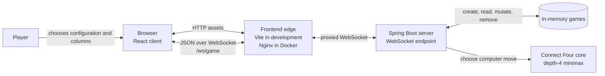
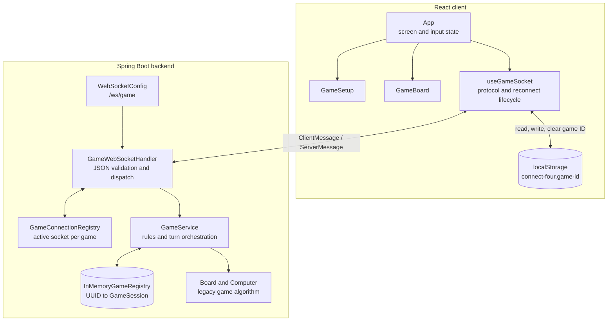
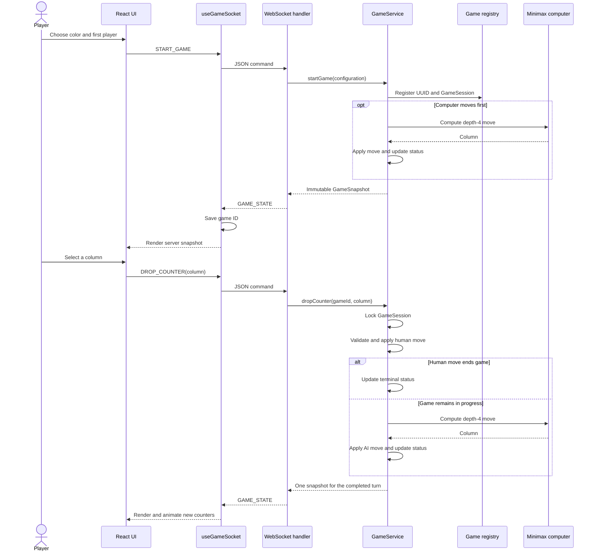
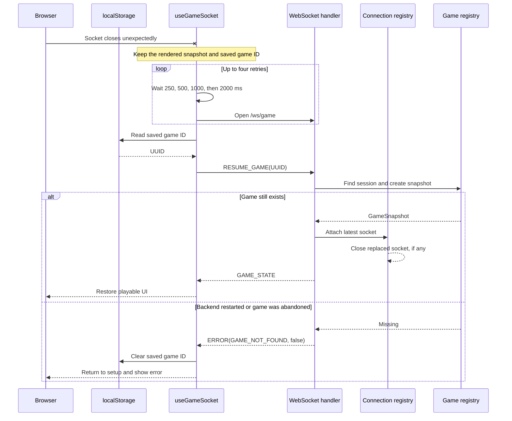
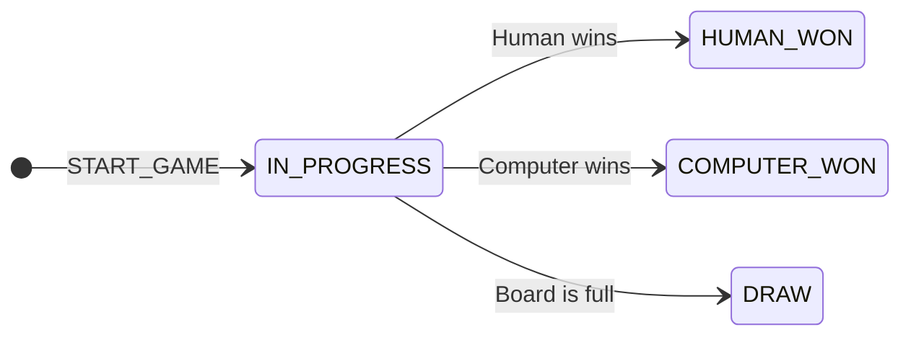
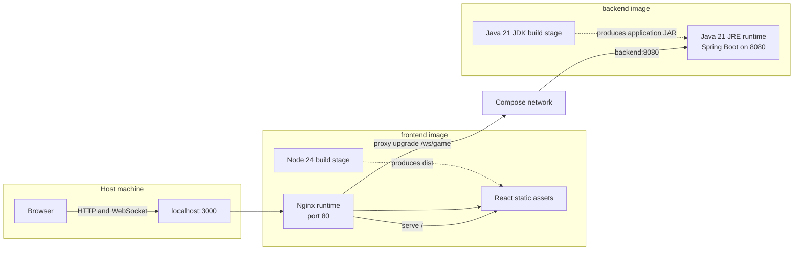

# Connect Four architecture

This document describes the local full-stack Connect Four application as it is
implemented today. The system is intentionally small: one React client, one
Spring Boot process, a raw JSON WebSocket protocol, and in-memory game state.

Deeper implementation guides:

- [Backend structure and object-oriented design](backend-design.md)
- [Frontend structure and React design](frontend-design.md)

## System context



The backend is the source of truth. The browser renders snapshots and keeps a
game ID for resumption, but it never calculates or commits a legal move itself.

## Component structure



### Responsibilities

- `App` owns setup choices and derives whether input is currently enabled.
- `GameBoard` renders the server snapshot and reports a selected zero-based
  column. Its drop animation is presentation only.
- `useGameSocket` owns one browser socket, protocol parsing, request-in-flight
  state, bounded reconnection, and the saved game ID.
- `GameWebSocketHandler` validates envelopes and payloads, binds a socket to a
  game, dispatches commands, and maps failures to protocol errors.
- `GameService` owns game rules, lifecycle operations, board conversion, and
  the atomic human-plus-computer turn.
- `Board` and `Computer` retain the original stacking and minimax behavior.

## State ownership

| State | Owner | Lifetime and notes |
| --- | --- | --- |
| Board, colors, first player, and status | `GameSession` in Spring Boot | Authoritative until abandonment or server restart |
| UUID-to-session mapping | `InMemoryGameRegistry` | Process-local `ConcurrentHashMap`; no durable storage |
| Authoritative socket for a game | `GameConnectionRegistry` | Latest successful start or resume wins |
| Current rendered snapshot | React state in `useGameSocket` | Replaced by each `GAME_STATE` message |
| Current game ID | Browser `localStorage` | Resume pointer only; not a copy of the game |
| Setup selections and UI state | React components | Client-only and non-authoritative |

Possession of a game ID is sufficient to resume that game. There is no account,
authentication, or authorization layer in this local learning application.

## Gameplay flow



The client disables board input while a command is awaiting its response. The
server still validates every command because client state is not trusted.

## Concurrency model

The registry map is concurrent so unrelated game IDs can be located safely.
Mutation is serialized per `GameSession` with `synchronized (session)`:

- resume takes a consistent snapshot;
- a human move, AI calculation, AI move, and resulting status update occur
  under one session lock;
- abandon removes the same locked session instance from the registry.

This lets different games progress concurrently while preventing two commands
from interleaving within one game. Outgoing writes are also synchronized per
`WebSocketSession`. `GameConnectionRegistry` accepts only the latest attached
socket as active; a replaced socket is closed and cannot submit further moves.

These guarantees are process-local. Running multiple backend replicas would
require shared persistence, distributed coordination, and connection routing.

## Board representation and conversion

The legacy core and the API use opposite row orientations:

| Layer | Row `0` means | Empty/red/yellow values |
| --- | --- | --- |
| Core `Board` | Bottom row | `.`, `r`, `y` |
| `GameSnapshot` and React | Top row | `EMPTY`, `RED`, `YELLOW` |

`GameService.snapshot` iterates core rows from `5` down to `0`, so the mapping
is `uiRow = 5 - coreRow`; column numbers remain unchanged. The conversion is
one-way at the boundary because all mutations are applied to the core board.

## Reconnection flow



After four failed automatic attempts, the UI enters `disconnected` and offers
a manual reconnect. A temporary socket loss does not delete the server session.

## Game state machine



This diagram models the server-owned `GameStatus` only. A legal turn without a
winner leaves the game `IN_PROGRESS`; that self-transition is omitted to keep
the diagram legible. The win and draw states are deliberately not final nodes
because completed games remain resumable. `ABANDON_GAME` removes the session
from any status, while a backend restart discards every session. Disconnecting
and `RESUME_GAME` change socket ownership without changing game status.

## Failure behavior

| Failure | Server response or client behavior | Result |
| --- | --- | --- |
| Malformed JSON, missing/unknown type, or invalid payload | Recoverable protocol `ERROR` | Game and connection remain usable |
| Invalid configuration, column, or full column | Recoverable game `ERROR` | No accepted state mutation |
| Command before start/resume | Recoverable `NO_ACTIVE_GAME` | Client must start or resume first |
| Start/resume on a bound socket | Recoverable `CONNECTION_ALREADY_BOUND` | Existing binding remains authoritative |
| Move after a terminal result | Non-recoverable `GAME_FINISHED` | Terminal game remains stored |
| Replaced socket sends a command | Non-recoverable `STALE_CONNECTION` | Latest resumed socket remains authoritative |
| Unknown or abandoned UUID, including after restart | Non-recoverable `GAME_NOT_FOUND` | Client clears local ID and returns to setup |
| Unexpected server exception | Non-recoverable `INTERNAL_ERROR` | Internal details are not sent to the client |
| Invalid server message | Client creates `INVALID_SERVER_MESSAGE` | Message is ignored and an error is shown |
| Socket loss | Bounded exponential retry | Controls remain disabled until reconnected |

## Container topology



Only Nginx is published to the host. The backend is reachable from the
frontend container by the Compose service name `backend`; Nginx forwards the
WebSocket upgrade headers and does not buffer socket traffic.

## Running locally

### Native development

Prerequisites are Java 21 and Node.js 24 or newer. Start the backend from one
terminal:

```bash
cd backend
./mvnw spring-boot:run
```

On Windows, use `mvnw.cmd spring-boot:run` instead. Start the frontend from a
second terminal:

```bash
cd frontend
npm ci
npm run dev
```

Open `http://localhost:5173`. Vite serves the client and proxies `/ws` to the
backend at `http://localhost:8080`.

### Docker Compose

From the repository root:

```bash
docker compose up --build
```

Open `http://localhost:3000`. Stop and remove the application containers and
network with:

```bash
docker compose down
```

## Current boundaries

- Games disappear when the backend process restarts.
- The topology supports one backend instance and does not support horizontal
  scaling or cross-device discovery.
- The protocol has no authentication, authorization, version negotiation, or
  durable event history.
- TLS and public deployment concerns are deferred to the separately scoped
  cloud phase.
