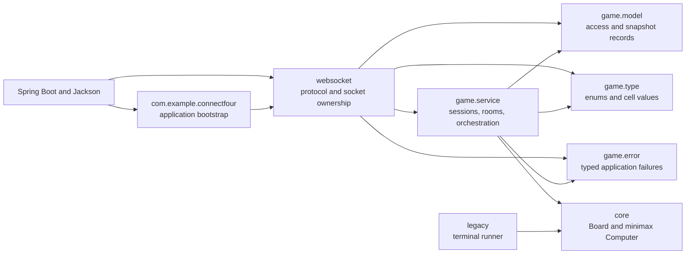
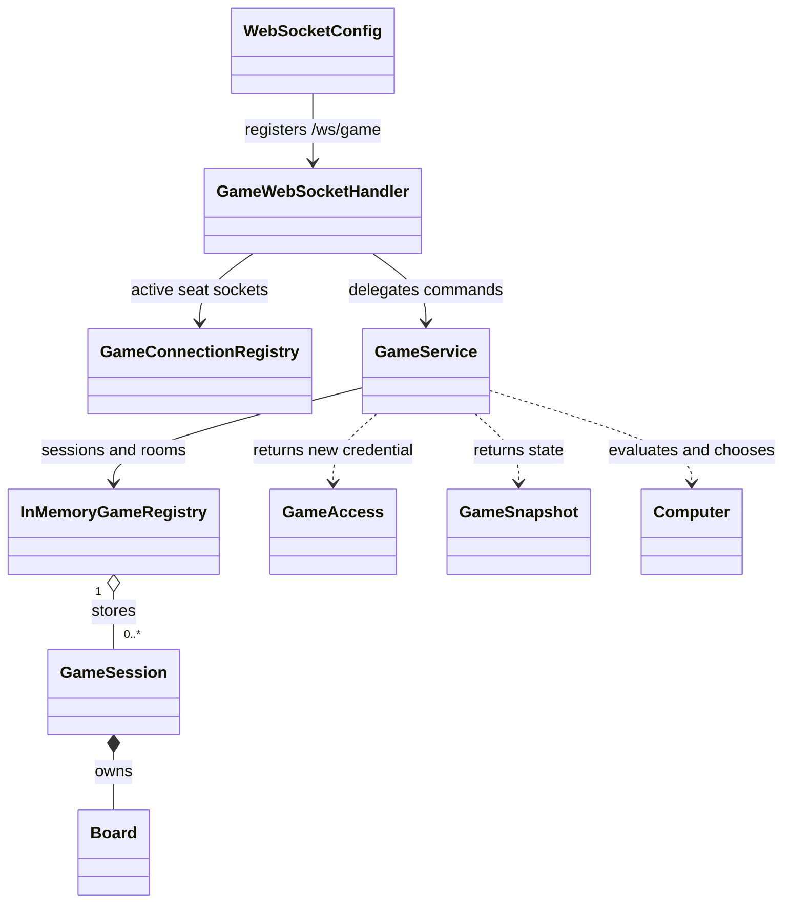

# Backend design

The Spring Boot backend separates WebSocket transport, game orchestration, and
the preserved Connect Four algorithm. It supports both `COMPUTER` and `ONLINE`
sessions without introducing a database.

For the complete wire contract and runtime flows, see
[Connect Four architecture](architecture.md).

## Package boundaries



`websocket` depends on the `game` subpackages, while the game layer has no
knowledge of JSON or WebSocket sessions. `game.service` owns orchestration and
mutable session internals, `game.model` contains response records, `game.type`
contains shared enums, and `game.error` contains typed failures. `core` contains
no Spring or transport dependencies, so the original board and AI remain
independently testable.

## Main objects



| Object | Responsibility |
| --- | --- |
| `WebSocketConfig` | Registers `/ws/game` and allowed origins |
| `GameWebSocketHandler` | Parses commands, validates connection state, binds seats, broadcasts snapshots, and sends errors |
| `GameConnectionRegistry` | Stores the latest socket for each `(gameId, playerColor)` and supplies striped game locks |
| `GameService` | Creates games, claims rooms, authenticates resumes, applies moves, tracks presence, abandons sessions, and builds snapshots |
| `InMemoryGameRegistry` | Maintains UUID-to-session and room-code-to-UUID concurrent maps |
| `GameSession` | Owns one mutable board plus its mode, players, tokens, room, status, turn, and presence |
| `GameAccess` | Returns a private `playerToken` with the first personalized snapshot |
| `GameSnapshot` | Immutable transport-facing game state |
| `Board` and `Computer` | Preserve stacking, position evaluation, and depth-4 minimax search |

Spring constructs the configuration, handler, service, registries, and
`JsonMapper` as singleton beans through constructor injection. Each
`GameSession`, `Board`, `GameAccess`, and `GameSnapshot` is created per use case.
`Computer` is created per calculation because it tracks traversal metrics and
must not share mutable search state across games.

## Session model

A `GameSession` contains:

- a UUID and `COMPUTER | ONLINE` mode;
- the mutable core `Board`;
- `startingColor`, `currentTurn`, and one of `WAITING_FOR_OPPONENT`,
  `IN_PROGRESS`, `RED_WON`, `YELLOW_WON`, or `DRAW`;
- a token for each occupied player-color seat;
- connection presence for occupied seats;
- an online room code, or the human color for a computer game.

For online creation, the host chooses red or yellow. The room starts in
`WAITING_FOR_OPPONENT`, its `startingColor` and `currentTurn` are red, and only
the host seat exists. The first guest to submit the room code atomically claims
the other color, receives a new token, and changes the status to `IN_PROGRESS`.
Later join attempts receive `ROOM_FULL`.

Computer games have one human seat and no room code. `opponentConnected` is
always true in their snapshots. `startingColor` reflects the chosen first
player, while `currentTurn` represents when the human may submit the next move.

## Registry and lifecycle

`InMemoryGameRegistry` uses two `ConcurrentHashMap` indexes:

```text
game UUID  -> GameSession
room code  -> game UUID
```

Online registration reserves a generated six-character code with
`putIfAbsent`; a collision triggers generation of another code. The alphabet
omits ambiguous characters. Server room lookup trims and uppercases input.

An explicit `ABANDON_GAME` conditionally removes the same session instance from
the UUID index and removes its room-code index entry. The handler then detaches
all current sockets and sends `GAME_ABANDONED`: `YOU_LEFT` to the caller and
`OPPONENT_LEFT` to the other player. An unexpected socket close does not remove
the session; it only updates that seat's presence.

All sessions, room codes, and tokens are process-local. A restart loses them,
and there is no database, account service, matchmaking service, or match
history.

## Command handling

The transport accepts these commands:

- `START_GAME {humanColor, firstPlayer}`
- `CREATE_ONLINE_GAME {hostColor}`
- `JOIN_ONLINE_GAME {roomCode}`
- `RESUME_GAME {gameId, playerToken}`
- `DROP_COUNTER {column}`
- `ABANDON_GAME {}`

Starting or claiming a seat returns `GAME_SESSION {playerToken, game}`. Resuming
authenticates the token against the requested game and returns `GAME_STATE`.
Only the token's color is bound to the new socket; knowing a UUID or room code
alone cannot resume an occupied seat.

`DROP_COUNTER` first checks that the socket is still the active connection for
its bound seat. `GameService` then verifies the seat, column, game status,
online presence, and turn before mutating the board.

For online play, one accepted command places exactly one counter, updates the
result, changes `currentTurn` to the opponent when play continues, and causes
personalized `GAME_STATE` snapshots to be broadcast to both seats. Red always
starts.

For computer play, one accepted human command may place both the human and AI
counters. The AI runs only if the human move was not terminal; the combined
turn is returned as one snapshot with `computerColumn` identifying the AI
counter for the client animation.

## Presence, reconnection, and socket replacement

`GameConnectionRegistry` keys connections by both game UUID and player color.
This lets an online game retain two active sockets. Attaching a new socket for
one seat atomically replaces and closes only that seat's previous socket with
the reason `Game resumed on another connection`.

On a genuine active-socket disconnect, the handler:

1. removes the mapping only if it still points to the closing socket;
2. marks that color disconnected in the session;
3. broadcasts a personalized snapshot to the remaining connection.

The compare-and-remove step prevents a replaced socket's later close callback
from marking the newly resumed seat offline. A valid resume attaches the new
socket, marks the seat connected, returns its state, and broadcasts restored
presence to the opponent.

Presence does not change `GameStatus`. Online controls are effectively paused
because `GameService` rejects a move unless both seats exist and both are
connected. The existing board and `currentTurn` remain available indefinitely
until resume, explicit abandonment, or server restart.

## Concurrency

The handler obtains one of 64 deterministic striped locks for each game UUID.
Within that lock it coordinates connection changes, service calls, broadcasts,
and abandonment. Hash collisions can serialize unrelated games but do not mix
their state.

`GameService` additionally synchronizes on the `GameSession` before reading or
mutating domain state. This makes seat claiming, presence changes, turns,
terminal-state updates, and removal checks atomic for a session. The complete
human-plus-AI turn stays under this monitor. WebSocket writes are synchronized
on the receiving `WebSocketSession`.

These guarantees do not cross process boundaries. Horizontal scaling would
need shared persistence, distributed locking or atomic commands, shared
pub/sub, and connection routing.

## Snapshot boundary

The core board stores row zero at the bottom and uses `.`, `r`, and `y`.
`GameService` reverses rows and maps tokens to `EMPTY`, `RED`, and `YELLOW` for
the API. `GameSnapshot` copies the outer board list and every row, preventing a
caller from modifying server state through a response.

Every online recipient gets a separate snapshot so `yourColor` and
`opponentConnected` are correct for that seat. `currentTurn` becomes null after
a win or draw; `computerColumn` is null outside an AI response.

## Error translation

Expected application failures are `GameException` values with stable codes:

- `GAME_NOT_FOUND`, `ROOM_NOT_FOUND`, `ROOM_FULL`, and
  `INVALID_PLAYER_TOKEN` for lookup and seat access;
- `NOT_YOUR_TURN` and `OPPONENT_OFFLINE` for online coordination;
- `INVALID_CONFIGURATION`, `INVALID_COLUMN`, `COLUMN_FULL`, and
  `GAME_FINISHED` for game validation.

The handler wraps these as `ERROR {code, message, recoverable}`. It also owns
transport codes such as `NO_ACTIVE_GAME`, `CONNECTION_ALREADY_BOUND`, and
`STALE_CONNECTION`. Unexpected exceptions are logged and exposed only as
`INTERNAL_ERROR`.

## Design patterns and intentional limits

- **Layered architecture:** WebSocket delivery depends inward on application
  rules and the core algorithm.
- **Service layer:** `GameService` coordinates use cases without transport
  concerns.
- **Registry:** the two registries encapsulate process-local game lookup and
  live socket ownership.
- **Aggregate-like boundary:** package-private `GameSession` groups state that
  must change consistently.
- **Immutable DTOs:** records and enums constrain the boundary values.
- **Boundary adapter:** the handler maps JSON to service calls, while snapshot
  conversion isolates the legacy board representation.
- **Exception translation:** typed service failures become stable wire errors.

There is deliberately no repository interface, durable store, event bus, CQRS,
AI strategy interface, or session factory. Those abstractions should be added
only when a second implementation or persistence requirement exists.

## Tests and change locations

| Test area | Coverage |
| --- | --- |
| `BoardTest`, `ComputerTest` | Preserved stacking, copying, evaluation, and minimax behavior |
| `GameServiceTest` | Computer regressions, room lifecycle, seat assignment, turns, wins/draws, presence, tokens, and cleanup |
| `GameWebSocketIntegrationTest` | Two-client broadcasts, authorization, reconnect/replacement, disconnect pause, abandonment, and errors |

| Change | Primary location |
| --- | --- |
| Wire message or connection lifecycle | `websocket/GameWebSocketHandler` |
| Active seat socket or game lock | `websocket/GameConnectionRegistry` |
| Room, turn, token, presence, or AI orchestration | `game/service/GameService` |
| Session and room indexes | `game/service/InMemoryGameRegistry` |
| Per-game mutable state | `game/service/GameSession` |
| Snapshot fields | `game/model/GameSnapshot` and frontend protocol types |
| Shared game enums and cell values | `game/type` |
| Stable service errors | `game/error` |
| Counter stacking or minimax | `core/Board` and `core/Computer` |
