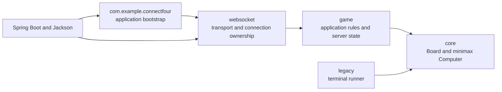
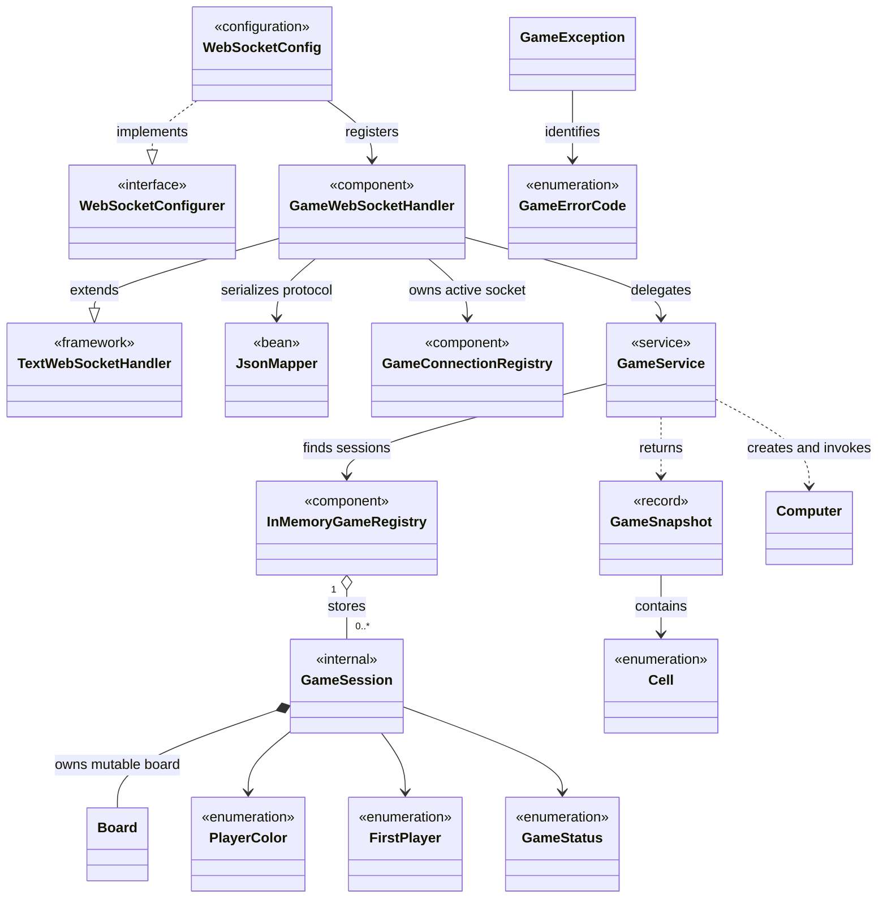

# Backend structure and object-oriented design

This guide explains how the Spring Boot backend is divided, how its classes
depend on each other, and which object-oriented patterns are present. For the
system-wide protocol, runtime, and container views, see
[Connect Four architecture](architecture.md).

## Package boundaries

Dependencies point inward from delivery concerns toward the game algorithm:

- `websocket` knows about `game`, but `game` does not know about WebSockets or
  JSON.
- `game` knows about `core` because it orchestrates the preserved board and AI.
- `core` has no Spring, transport, or application dependencies.
- `legacy` is a separate terminal entry point. The server does not call it.

This separation lets the game service be tested without starting Spring or a
WebSocket server, while the original algorithm remains usable on its own.

## Class dependency map

The arrows describe source-level dependencies, not every runtime call. Protocol
payload records are non-public nested types inside `GameWebSocketHandler`, so
they do not become dependencies of the game layer.

## How Spring constructs the application

`ConnectFourBackendApplication` starts component scanning from the root
package. Spring creates the long-lived objects and satisfies their single
constructors without requiring `@Autowired`:

| Spring-managed object | Constructor dependencies | Role |
| --- | --- | --- |
| `WebSocketConfig` | `GameWebSocketHandler` | Registers `/ws/game` and allowed local origins |
| `GameWebSocketHandler` | `GameService`, `GameConnectionRegistry`, `JsonMapper` | Parses, validates, dispatches, and serializes messages |
| `GameService` | `InMemoryGameRegistry` | Runs application use cases and enforces game rules |
| `InMemoryGameRegistry` | None | Stores game sessions by UUID |
| `GameConnectionRegistry` | None | Stores the latest active socket by game UUID |
| `JsonMapper` | Spring Boot auto-configuration | Converts JSON and Java records |

These beans use Spring's default singleton scope. They contain either no
mutable state or thread-safe registries designed to serve many games.

The following objects are deliberately **not** Spring beans:

- one `GameSession` and one `Board` are created for each new game;
- `GameSnapshot` values are created for responses and then discarded;
- `Computer` is created for each AI or status calculation;
- the handler's envelope and payload records exist only while processing JSON.

Creating `Computer` per calculation is important because the preserved class
tracks `nodesTraversed` internally. Sharing one singleton `Computer` would mix
that mutable counter across concurrent games.

## Request and dependency flow

A command follows one direction through the layers:

1. `WebSocketConfig` routes `/ws/game` traffic to `GameWebSocketHandler`.
2. `GameWebSocketHandler` converts JSON into a command record and validates
   connection-level rules.
3. `GameConnectionRegistry` confirms that the socket is authoritative for its
   game.
4. `GameService` performs `startGame`, `resumeGame`, `dropCounter`, or
   `abandonGame`.
5. `InMemoryGameRegistry` locates the package-private `GameSession`.
6. `GameService` mutates `Board`, invokes `Computer`, and updates `GameStatus`.
7. `GameService` returns an immutable `GameSnapshot` in API row order.
8. `GameWebSocketHandler` wraps the snapshot in a server envelope and
   serializes it back to JSON.

Errors travel outward in the opposite direction. `GameService` throws a
`GameException` carrying a `GameErrorCode`; the handler translates it into the
transport-level `ERROR` envelope and decides whether the failure is
recoverable. Unexpected exceptions are logged and reduced to `INTERNAL_ERROR`
so implementation details are not exposed.

## The domain object boundary

`GameSession` acts as the internal owner of one game:

- its UUID, board, human color, and first player are fixed after construction;
- its status and board contents are mutable;
- it is package-private, so transport code cannot mutate it directly;
- `GameService` is the only production class that coordinates its changes.

The object is also the per-game monitor lock. `resumeGame`, `dropCounter`, and
`abandonGame` synchronize on the session instance. A human move, the AI search,
the AI move, and the resulting status update therefore form one atomic turn.
Different sessions can still progress concurrently.

`GameSnapshot` is the boundary value returned to callers. It is a Java record,
and its compact constructor copies the outer board and every row. This prevents
callers from mutating the server's board through a response object.

The core `Board` provides the other defensive boundary: `getBoard()` returns a
new array and `getCopy()` creates an independent board for minimax branches.

## Object-oriented patterns in use

### Layered architecture

Transport, application rules, and the core algorithm live in separate
packages. Each layer has a narrower reason to change, and dependencies do not
point back toward the WebSocket layer.

### Dependency injection and inversion of control

Spring constructs infrastructure and application services through constructor
injection. Classes declare what they need, while the framework controls object
creation and startup order. The single constructors also make manual unit-test
construction straightforward.

This is dependency injection, but not complete dependency inversion:
`GameService` intentionally depends on the concrete `InMemoryGameRegistry` and
creates concrete `Computer` instances because the application currently has
only one storage mechanism and one AI implementation.

### Service Layer

`GameService` is an application service. It exposes the four backend use cases
and coordinates validation, persistence, the domain object, the AI, and result
mapping. The WebSocket handler does not duplicate these rules.

### Registry, with repository-like behavior

`InMemoryGameRegistry` encapsulates the concurrent UUID-to-session map behind
`register`, `find`, and conditional `remove` operations. It resembles the
Repository pattern, but `Registry` is the more accurate current name: there is
no persistence abstraction, query language, or alternate implementation.

`GameConnectionRegistry` applies the same idea to transport ownership. Its
`attach` operation replaces and closes the previous socket, making “latest
resume wins” one cohesive behavior rather than scattered handler logic.

### Aggregate-like session boundary

`GameSession` is similar to a small aggregate root: it groups the identity,
configuration, board, and status that must change consistently. Package
visibility prevents external layers from reaching through the service to
modify it. This project does not otherwise implement full Domain-Driven Design.

### Immutable DTO and value objects

`GameSnapshot` is an immutable data-transfer value. `PlayerColor`,
`FirstPlayer`, `GameStatus`, `Cell`, and `GameErrorCode` are enums that constrain
valid values and avoid loosely typed strings inside the application layer.

The handler's nested records are transport DTOs. Keeping them non-public
prevents wire-format details from leaking into domain classes.

### Boundary adapter

`GameWebSocketHandler` adapts raw WebSocket JSON to application method calls.
`GameService.snapshot` adapts the legacy core board—bottom row first with
character tokens—to the API board—top row first with `Cell` values. This keeps
the unusual core representation from spreading into the frontend or transport
code.

### Template Method through the framework

`GameWebSocketHandler` extends Spring's `TextWebSocketHandler` and overrides
framework callbacks such as `handleTextMessage` and `afterConnectionClosed`.
Spring owns the surrounding WebSocket lifecycle and calls those extension
points. `WebSocketConfig` similarly implements the framework's
`WebSocketConfigurer` callback interface.

### Exception translation

The game layer reports typed domain/application failures with `GameException`.
The handler catches those exceptions and translates them into stable protocol
errors. This prevents JSON and recoverability concerns from entering
`GameService`.

## Patterns intentionally not introduced

- There is no `GameRegistry` interface because only one in-memory
  implementation exists. An interface becomes useful when durable storage is
  actually added.
- There is no AI Strategy interface because only the preserved minimax player
  exists. `Computer` is a direct collaborator, not a pluggable strategy today.
- There is no separate factory for `GameSession`; construction is short and
  belongs to the `startGame` use case.
- There is no event bus, CQRS model, or event sourcing. Commands mutate one
  in-memory session and return its latest snapshot.
- Spring's default bean scope is singleton, but the code does not implement the
  GoF Singleton pattern or use global static instances.

Avoiding these abstractions keeps the learning application small. They should
be introduced only when a second implementation or new lifecycle requirement
creates a concrete seam.

## Where changes belong

| Change | Primary location |
| --- | --- |
| WebSocket message or connection rule | `websocket/GameWebSocketHandler` |
| Endpoint registration or allowed origin | `websocket/WebSocketConfig` |
| Resume socket ownership | `websocket/GameConnectionRegistry` |
| Game validation or turn orchestration | `game/GameService` |
| Server game storage | `game/InMemoryGameRegistry` |
| Game state carried across a turn | `game/GameSession` |
| API snapshot shape | `game/GameSnapshot` and frontend protocol types |
| Counter stacking or board copying | `core/Board` |
| Minimax scoring or search | `core/Computer` |

The existing tests follow the same boundaries: `BoardTest` and `ComputerTest`
characterize the preserved core, `GameServiceTest` exercises application rules
with manually constructed dependencies, and `GameWebSocketIntegrationTest`
tests the complete transport path through a running Spring context.
