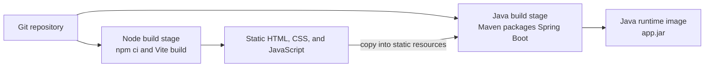
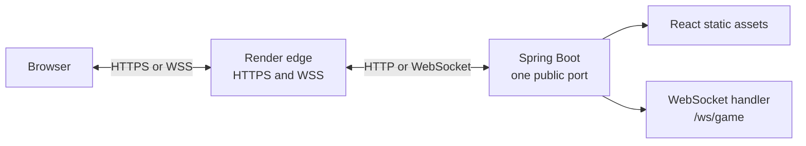

# Cloud deployment

This document explains how Connect Four is packaged and deployed to Render.
The frontend and backend remain separate source projects, but production uses
one Docker image and one Render Web Service.

## Deployment artifacts

| File | Purpose |
| --- | --- |
| `infra/Dockerfile` | Builds the frontend and backend into one production image |
| `infra/Dockerfile.dockerignore` | Keeps local build output and development files out of the Docker build context |
| `infra/render.yaml` | Declares the Render Web Service, free plan, region, health check, and automatic deployment policy |
| `backend/src/main/resources/application.properties` | Connects Spring configuration to Render environment variables |

The local `compose.yaml`, `frontend/Dockerfile`, and `backend/Dockerfile` run
the frontend and backend as separate containers. They are not used by the
Render deployment.

## Image build

`infra/Dockerfile` is a multi-stage build:



1. Node installs the locked frontend dependencies and runs the Vite production
   build.
2. The generated `dist` files are copied into Spring Boot's static resources.
3. Maven packages the backend and those assets into the executable application
   JAR.
4. The final image contains only the Java runtime and application JAR. It runs
   as a non-root `connectfour` user.

Build tools and intermediate files remain in earlier stages, keeping them out
of the runtime image.

## Runtime request flow

Render terminates HTTPS and forwards traffic to the Spring Boot process:



Spring serves the React application for HTTP requests and handles game traffic
at `/ws/game`. The frontend constructs its socket URL from the current browser
host, choosing `wss` when the page uses HTTPS. Consequently, the page and
WebSocket share one Render domain and no separate backend URL is compiled into
the frontend.

## Runtime configuration

Render injects a `PORT` environment variable into the service. Spring reads it
through this property, falling back to port `8080` outside Render:

```properties
server.port=${PORT:8080}
```

Allowed WebSocket origins are grouped under the typed
`ConnectFourProperties` configuration object. They can be overridden in
Render with `WEBSOCKET_ALLOWED_ORIGIN_PATTERNS` without changing source code.
See [Spring Boot configuration and environment variables](spring-configuration.md)
for the complete configuration model.

## Render deployment lifecycle

`infra/render.yaml` declares one Docker Web Service named `connect-four-game`.
Its `dockerfilePath` points to `infra/Dockerfile`, while its `dockerContext`
remains the repository root so the build can access both application projects.
Render checks `/` for service health and automatically builds a replacement
image after a commit reaches the connected branch.

The first deployment is created by connecting the Git repository as a Render
Blueprint. In the setup form, set **Blueprint Path** to `infra/render.yaml`,
then apply the detected resources. Do not set the service's Root Directory to
`infra/`: files outside a Render root directory are unavailable to its build,
and this image needs the root-level `frontend/` and `backend/` directories.

For an existing Blueprint, change **Blueprint Path** to `infra/render.yaml` on
the Blueprint's Settings page and sync it. Render documents custom Blueprint
paths in [Render Blueprints](https://render.com/docs/infrastructure-as-code#setup).

Subsequent deployments are triggered automatically by commits. Render
publishes the application on an HTTPS `onrender.com` URL after a successful
health check.

## Free-service behavior

The Render free Web Service spins down after 15 minutes without inbound HTTP
traffic or WebSocket messages. The next request starts it again and can take
about a minute to receive a response. Its filesystem is ephemeral, so files
created at runtime are lost on sleep, restart, and redeployment.

Game sessions currently live in backend memory. They are therefore also lost
whenever the process stops. Browser `localStorage` retains only a game ID; it
cannot restore a game that no longer exists on the server.

If persistent data is added later, it should use a managed database connected
through environment variables rather than writing inside the application
container. Render's current free-tier behavior is documented in
[Deploy for Free](https://render.com/docs/free).

## Why production uses one service

One service is a deliberate fit for this side project:

- it consumes only one free Web Service;
- frontend and backend versions are deployed together;
- HTTP and WebSocket traffic share one origin;
- no production reverse-proxy container or cross-service URL is required.

The trade-off is coupled deployment and scaling: even a frontend-only change
rebuilds the complete image. If those concerns become important, the frontend
can later move to a static host while Spring remains a separate WebSocket
service.
