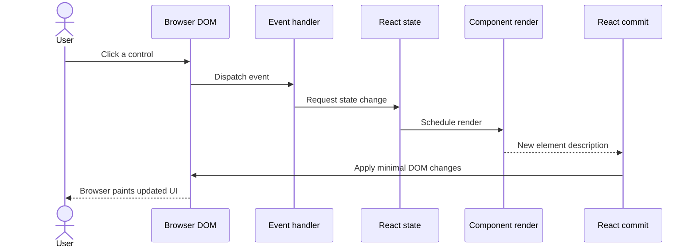
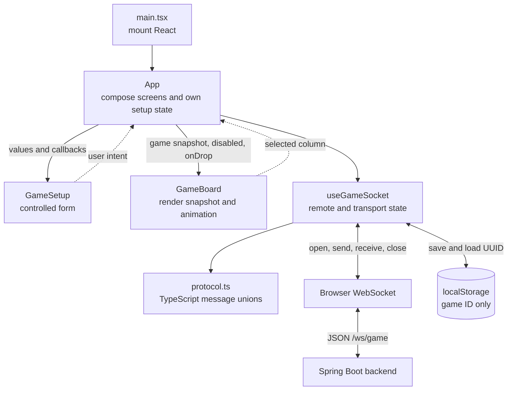
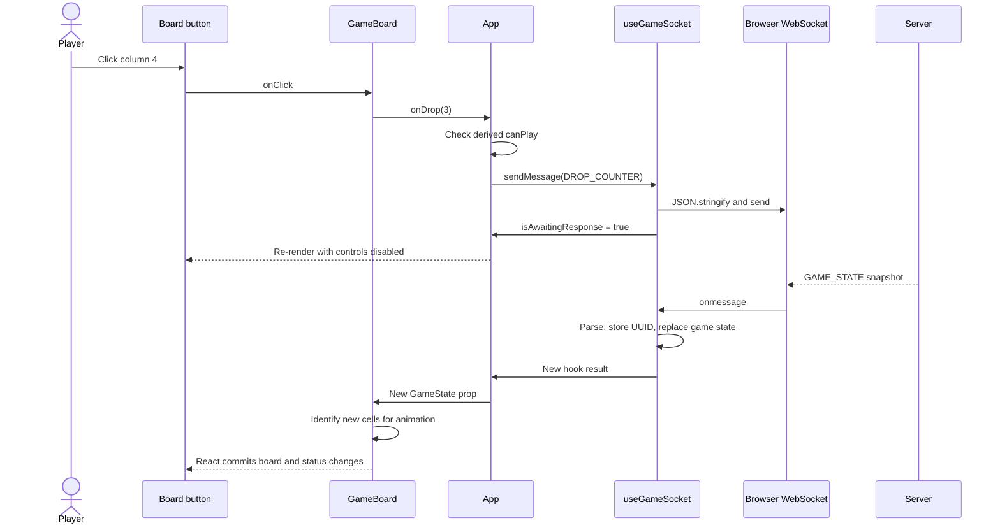

# Frontend structure and React design

This guide explains the React frontend for someone familiar with backend
development but new to modern browser applications. It covers the browser
mental model, this repository's code structure, the patterns it uses, and the
practices worth carrying into future frontend work.

For the full system and protocol, see
[Connect Four architecture](architecture.md). For the corresponding server
design, see [Backend structure and object-oriented design](backend-design.md).

## A browser and React mental model

The browser maintains a **Document Object Model (DOM)**: an in-memory tree of
the HTML elements currently on screen. CSS selects nodes in that tree and
controls their layout and appearance. Browser events such as clicks, socket
messages, and timers execute JavaScript callbacks on the page's event loop.

React adds a declarative layer over the DOM. A component is a function that
describes what part of the DOM should look like for its current inputs:

- **props** are values passed into the component by its parent;
- **state** is component-owned memory that survives renders;
- **JSX** is syntax for describing element trees, not an HTML string;
- an **event handler** responds to user interaction;
- an **effect** synchronizes the component with something outside React, such
  as a WebSocket, timer, browser storage, or third-party API.

When props or state change, React calls affected component functions again,
compares the new element descriptions with the previous render, commits the
necessary DOM changes, and lets the browser lay out and paint the result.



Rendering should be treated like a pure calculation: the same props and state
should describe the same UI. Network connections and timers belong in effects
or event handlers, not directly in the render body.

### Approximate backend-to-frontend translations

These comparisons are learning aids, not exact one-to-one mappings:

| Backend concept | Rough frontend analogue |
| --- | --- |
| Application entry point | `main.tsx` creates the React root |
| Object construction graph | Component tree created through JSX |
| Method parameters | Component props |
| Instance fields that affect output | React state |
| Derived getter | Value calculated during render |
| Controller action | User event handler |
| Long-lived integration client | Custom hook managing an effect and resource |
| DTO types | TypeScript protocol types |
| Server-side template rendering | Component render produces an element description |

Unlike a typical injected service object, a component function may execute
many times. Local variables are recreated on every render; state and refs are
the mechanisms that persist values between renders.

## Source layout

```text
frontend/
├── index.html                  Browser document and #root mount point
├── src/
│   ├── main.tsx                React bootstrap
│   ├── App.tsx                 Screen composition and top-level UI state
│   ├── components/
│   │   ├── GameSetup.tsx       Controlled game-configuration form
│   │   └── GameBoard.tsx       Board controls, grid, and drop animation
│   ├── hooks/
│   │   └── useGameSocket.ts    WebSocket and reconnection lifecycle
│   ├── types/
│   │   └── protocol.ts         Client/server message contracts
│   ├── test/                   Browser API test doubles and setup
│   └── styles.css              Global design, layout, and animation rules
├── vite.config.ts              Dev server, WebSocket proxy, and test config
├── tsconfig.app.json           Strict TypeScript settings
└── eslint.config.js            JavaScript, TypeScript, React, and hook rules
```

`main.tsx` is intentionally small. It finds the `#root` DOM node from
`index.html`, creates a React root, loads global CSS, and renders `App` inside
`StrictMode`. Strict mode performs extra development checks and can repeat
setup/cleanup work to reveal unsafe side effects; it does not duplicate the
production UI.

## Component and data-flow structure



Data flows down through props. User intent flows up through callback props.
This is React's **one-way data flow**: child components do not reach into their
parent or into each other to mutate state.

### Component responsibilities

| Unit | Owns | Receives or exposes |
| --- | --- | --- |
| `main.tsx` | Browser mounting only | Renders `App` |
| `App` | Selected color and first player | Consumes `useGameSocket`; passes props and callbacks |
| `GameSetup` | No domain state | Controlled values, disabled state, and change/submit callbacks |
| `GameBoard` | Drop-animation bookkeeping | Server snapshot, disabled state, and `onDrop(column)` |
| `useGameSocket` | Socket, connection state, remote snapshot, errors, retry state | Exposes commands and connection actions to `App` |
| `protocol.ts` | No runtime state | Compile-time message and game types |

`App` acts as the composition boundary. It knows which screen to show and how
UI intent becomes a protocol command. `GameSetup` and `GameBoard` do not know
that WebSockets exist, which keeps them focused and easier to test.

## State ownership

Good frontend design starts by giving each piece of state one clear owner.

### Local UI state

`App` owns `humanColor` and `firstPlayer` because both values are shared with
`GameSetup` and are needed when `App` creates `START_GAME`. This is called
**lifting state up** to the nearest common owner.

`GameSetup` is a **controlled component**. Each radio input receives a
`checked` value from props and reports changes through a callback. The DOM input
is not a second source of truth.

### Remote and transport state

`useGameSocket` owns:

- `connectionState`;
- the latest server `game` snapshot;
- the current `error`;
- whether one command is awaiting a response;
- an internal reconnect request counter.

The backend remains authoritative. The frontend replaces its `game` value when
`GAME_STATE` arrives; it does not independently apply game rules or predict the
AI response. `localStorage` contains only the UUID needed to ask the backend to
resume the real state.

### Presentation state

`GameBoard` remembers the previous board reference and compares it with the new
snapshot to identify counters that should animate. This state controls only
presentation and cannot affect whether a move is legal.

The component uses a guarded state update when it sees a new board reference.
That is an advanced and uncommon React technique: the guard is essential to
prevent an infinite render loop. Most derived values should simply be computed
during render, and most external synchronization should use an effect. Here the
extra render lets animation metadata be ready for the same DOM commit as the
new counters.

### Derived state

Values such as `isConnected` and `canPlay` are calculated during every `App`
render rather than stored separately. This avoids contradictory combinations,
such as stored `canPlay = true` while the connection is actually closed.

As a rule: store the smallest independent facts and derive everything else.

## React hooks used here

### `useState`

`useState` retains a value between renders and provides a setter. Calling the
setter schedules a render; it does not synchronously rewrite the DOM.

The project uses state for values that affect rendered output: form choices,
connection status, errors, snapshots, waiting indicators, and animation data.

### `useRef`

`socketRef` retains the current `WebSocket` object without causing a render
when it changes. A ref is suitable for an imperative resource that rendering
needs to use but does not directly display.

The callbacks also compare `socketRef.current` with the socket that fired an
event. This prevents a late event from a replaced socket from overwriting the
state belonging to the current connection.

### `useEffect`

The socket effect opens the connection after React commits the component. Its
cleanup cancels the retry timer, marks the effect as disposed, clears the ref,
and closes the socket. React runs that cleanup when `App` unmounts or before the
effect is restarted.

This setup/cleanup symmetry is an important frontend practice. Any effect that
subscribes, connects, schedules, or allocates should undo that work. It avoids
leaked timers, duplicate listeners, and updates from stale resources, and it
makes the effect safe under development `StrictMode` checks.

The `connectionRequest` counter is an explicit restart signal. The manual
Reconnect button increments it, changing the effect dependency and causing
React to clean up the old connection lifecycle before starting a new one.

### `useCallback`

`sendMessage`, `reconnect`, and `clearError` are memoized callbacks. Their
function identity remains stable across renders until a dependency changes.
This is useful for a hook API that is passed to other components, but
`useCallback` should not be added everywhere automatically; it has value only
when stable identity or avoided recalculation matters.

## Following one move through the frontend



Notice that `GameBoard` reports an intention rather than sending a socket
message. `App` owns the policy check, and the hook owns the transport. Each
layer has one reason to change.

## TypeScript and the protocol boundary

`protocol.ts` uses string-literal unions and discriminated unions. For example,
`ServerMessage` can be `GAME_STATE`, `GAME_ABANDONED`, or `ERROR`, and each type
has its corresponding payload. A `switch` on `message.type` lets TypeScript
narrow the payload safely.

Strict compiler settings catch unused values, unsafe implicit types, and
fall-through switch cases. `as const` keeps values such as `RED` or
`DROP_COUNTER` as precise literals rather than widening them to general
strings.

TypeScript exists only during development and build; its types are erased from
the JavaScript sent to the browser. Network data is therefore still `unknown`
at runtime. `parseServerMessage` verifies JSON and the envelope type before
using it, but currently trusts each recognized payload shape. A production
system with an independently evolving or untrusted API would normally add full
runtime schema validation. The Java and TypeScript protocol definitions are
manually synchronized in this learning project.

## DOM structure and accessibility

React does not replace HTML semantics. The components use native elements
where possible:

- `form`, `fieldset`, `legend`, `label`, radio inputs, and submit buttons make
  setup usable by keyboard and assistive technology;
- real `button` elements provide focus and disabled behavior;
- `main`, `header`, and `section` communicate page structure;
- the custom board uses `grid`, `row`, and `gridcell` roles plus readable cell
  labels because plain `div` elements have no board semantics;
- `aria-live` announces connection and game-status changes;
- `role="alert"` announces errors;
- `aria-busy` exposes the waiting state;
- decorative counters and arrows use `aria-hidden="true"`.

Prefer native semantic elements first. Add ARIA when building a custom widget
or when native HTML cannot express the relationship. ARIA should complement
behavior, not substitute for keyboard support or real disabled controls.

## Styling and responsive design

The project uses one global `styles.css` rather than a CSS framework:

- custom properties such as `--blue` and `--paper` act as design tokens;
- Flexbox handles one-dimensional alignment and CSS Grid handles the setup and
  board layouts;
- `clamp()` makes spacing and type scale smoothly with the viewport;
- modifier classes such as `connected`, `yellow`, and `is-dropping` express
  visual states supplied by React;
- media queries adapt layout at 760 px and 480 px;
- `prefers-reduced-motion` removes nonessential animation for users who request
  it;
- pseudo-elements create the board's foreground face so counters animate
  behind it.

Most styling is class-based. The board uses inline CSS custom properties only
for values that are calculated per counter, such as drop distance and delay.
This keeps structural styling in CSS while allowing component data to
parameterize the animation.

CSS is global, so class naming is the current collision-avoidance convention.
CSS Modules or another scoping system would become useful if the component set
grew large enough for global ownership to become unclear.

## Frontend patterns in use

### Declarative UI

Components describe the desired UI for the current state. They do not manually
find DOM nodes and update their text, classes, or visibility after every event.
React owns those DOM commits.

### Component composition

`App` builds the screen from focused child components. Composition is the main
reuse mechanism; there is no component inheritance hierarchy.

### One-way data flow and lifted state

Parents pass values down and children report events up. Shared state lives at
the closest common owner. This makes the source of each rendered value
traceable.

### Custom hook as transport adapter

`useGameSocket` adapts the imperative browser WebSocket API into declarative
React state and a small command API. Components consume `game`, `error`, and
`connectionState` rather than registering socket callbacks themselves.

### Controlled components

`GameSetup` inputs are controlled by React props. Submitting the form reports
the current parent-owned values, so browser DOM state and application state do
not drift apart.

### Dependency injection through props

React does not use a dependency-injection container here. `GameSetup` receives
change functions and `GameBoard` receives `onDrop`; tests can pass substitutes
such as mock functions. This is lightweight dependency injection through
function parameters.

### Immutable snapshot replacement

Incoming `GAME_STATE` payloads replace the previous snapshot instead of
mutating nested React state in place. New references make changes observable to
React and allow `GameBoard` to compare snapshots for animation.

## Testing strategy

The frontend uses Vitest, Testing Library, `user-event`, and jsdom:

| Test | Scope | What it proves |
| --- | --- | --- |
| `App.test.tsx` | Component integration | Complete setup, move, terminal result, and new-game flow |
| `useGameSocket.test.ts` | Custom hook | Connect, send, resume, storage, stale games, and retry timing |
| `GameBoard.test.tsx` | Focused component | New-counter animation metadata and restored-game behavior |
| `MockWebSocket.ts` | Test adapter | Deterministic browser WebSocket and storage behavior |

Testing Library queries controls by role and accessible name. This tests the UI
as a user encounters it and discourages coupling tests to private component
state or exact DOM nesting.

jsdom implements browser APIs needed for component tests but does not perform
real layout, paint CSS, or run a real network stack. Visual animation layering,
responsive layout, and the Nginx WebSocket proxy therefore still need browser
or container-level verification.

## Toolchain responsibilities

| Tool | Responsibility |
| --- | --- |
| Vite | Development server, React transformation, production bundling, `/ws` dev proxy |
| TypeScript | Static checking; emits no files directly in this configuration |
| ESLint | JavaScript/TypeScript correctness, hook rules, and refresh constraints |
| Vitest | Fast tests integrated with Vite's module handling |
| jsdom | Simulated DOM for tests |
| Nginx | Serves production assets and proxies WebSocket upgrades in Docker |

Startup commands and the development-versus-container network paths are in
[Connect Four architecture](architecture.md#running-locally).

## Abstractions intentionally not introduced

- No router is needed because setup and game are two conditional views at one
  URL.
- No global state library is needed because the component tree is shallow and
  each state value already has a clear owner.
- No React Context is needed because props are not being threaded through many
  unrelated levels.
- No server-state query library is needed because the application uses one
  stateful WebSocket protocol rather than request/response HTTP resources.
- No component library or CSS framework is needed for the small bespoke UI.
- No frontend game engine exists because the backend is authoritative.

Adding one of these tools should solve an observed scaling or lifecycle
problem, not anticipate one.

## Where changes belong

| Change | Primary location |
| --- | --- |
| Page-level screen or input policy | `src/App.tsx` |
| Setup fields or presentation | `src/components/GameSetup.tsx` |
| Board rendering, controls, or animation | `src/components/GameBoard.tsx` |
| Socket, retry, storage, or server-message behavior | `src/hooks/useGameSocket.ts` |
| Protocol message or snapshot shape | `src/types/protocol.ts` and backend transport types |
| Colors, layout, responsive rules, or motion | `src/styles.css` |
| Development proxy or test environment | `vite.config.ts` |

## Practices to carry forward

1. Keep rendering pure; put external synchronization in effects and always
   provide cleanup.
2. Give each state value one owner and derive values that can be calculated.
3. Pass data down and report intent upward through typed callbacks.
4. Keep server state authoritative instead of duplicating business rules in
   the browser.
5. Remember that TypeScript does not validate runtime network data.
6. Prefer semantic HTML and real disabled behavior before adding ARIA.
7. Test observable user behavior and isolate browser integrations behind small
   adapters.
8. Add libraries and abstractions only when the current structure has a
   concrete limitation.
