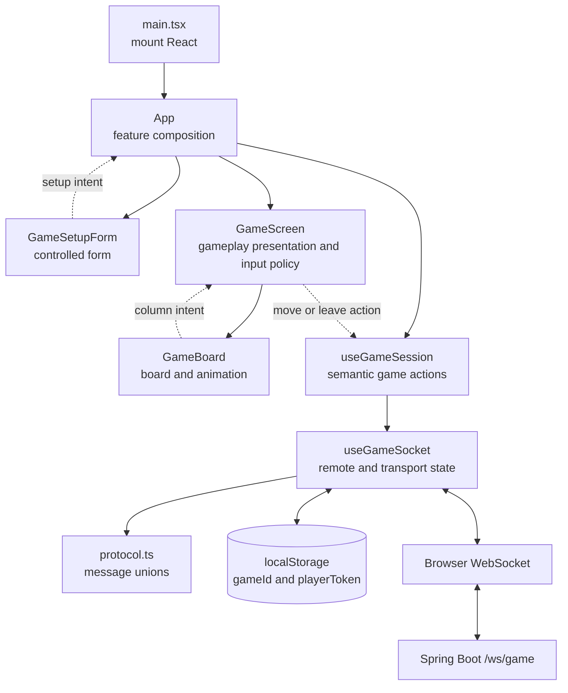
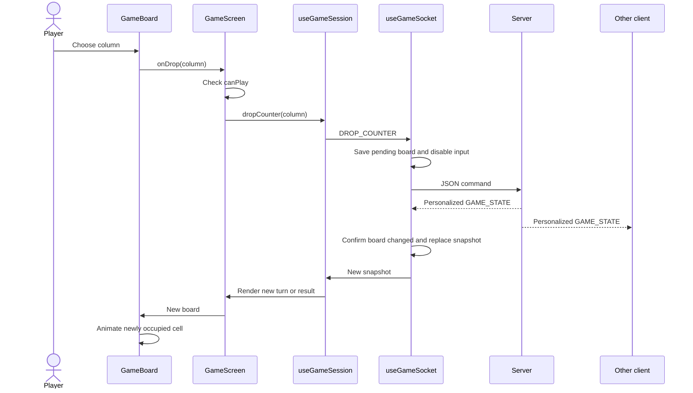

# Frontend design

The frontend is a React and TypeScript single-page client for both computer and
online Connect Four. It renders server-owned snapshots, turns user intent into
WebSocket commands, and keeps one private resume credential in browser storage.

For the complete wire contract, see
[Connect Four architecture](architecture.md#websocket-protocol).

## Source structure

```text
frontend/src/
├── main.tsx                         React bootstrap
├── app/                             Composition, shell, and app-level tests
├── domain/game.ts                   Game snapshot and value types
├── features/
│   ├── game-setup/                  Setup model, URL policy, form, and state
│   └── gameplay/                    Game screen, board, status, and selectors
├── services/game-session/           Semantic actions and WebSocket boundary
│   ├── useGameSession.ts            UI-facing start, move, and leave actions
│   ├── useGameSocket.ts             Socket lifecycle and remote state
│   ├── protocol.ts                  Client and server message unions
│   ├── protocol.parsers.ts          Runtime envelope parsing
│   ├── sessionStorage.ts            Resume credential persistence
│   └── pendingCommand.ts            Command acknowledgement policy
├── shared/styles/globals.css        Tokens, reset, and shared primitives
└── test/                            jsdom setup and MockWebSocket
```

`main.tsx` mounts `App` in `StrictMode`. `App` composes feature screens and keeps
the setup model mounted across game transitions. Components remain unaware of
raw WebSocket callbacks and message envelopes: `useGameSession` exposes semantic
actions, while `useGameSocket` adapts the imperative browser API into React
state and typed transport commands.

## Component and data flow



Data and policies flow down through props; setup changes and column selections
flow upward through callbacks. The backend remains authoritative. Neither
`App` nor `GameBoard` mutates the board or predicts a legal move.

## UI modes

`GameSetupForm` is a controlled form driven by the `useGameSetup` feature hook:

- **Play computer** chooses the human color and whether human or computer moves
  first, then sends `START_GAME`.
- **Play online / Create a room** chooses the host color, then sends
  `CREATE_ONLINE_GAME`.
- **Play online / Join a room** accepts a six-character code, then sends
  `JOIN_ONLINE_GAME`.

Room input is uppercased, stripped of non-alphanumeric characters, and limited
to six characters. A URL such as `?room=ABC123` initially selects the online
join form and prefills the code without a routing library. After a successful
join snapshot, `history.replaceState` removes only the `room` parameter.

The host's waiting view shows the room code and creates a shareable link from
the current origin. If the Clipboard API is missing or rejects the write, the
visible room code remains available and an accessible recovery message is
shown.

During a game, `GameScreen` displays personalized color, room and status information:
waiting for a guest, paused while the opponent is offline, the current turn,
win, loss, or draw. Online text always states that red moves first.

## State ownership

| State | Owner | Notes |
| --- | --- | --- |
| Mode, online action, selected color, first player, and room input | `useGameSetup`, mounted by `App` | Local form state preserved across game transitions |
| Invite-link copy result | `GameScreen` | Local presentation feedback |
| Connection state, current `GameState`, error, pending command, and manual reconnect trigger | `useGameSocket` | Remote and transport state |
| `{gameId, playerToken}` | `localStorage` at `connect-four.game-session` | Private bearer credential for resume |
| Previous board and counters to animate | `GameBoard` | Presentation only |
| Board, legal moves, turn, status, seats, and presence | Backend | Never duplicated as client business state |

The hook removes the legacy `connect-four.game-id` value. It validates the
stored JSON enough to require non-empty strings for both fields; invalid stored
data is cleared.

Because one origin has one storage value, two players should use separate
browsers, browser profiles, or private/normal contexts. Two ordinary tabs share
`localStorage` and are not a valid two-player test setup.

## Protocol lifecycle

Starting a computer game, creating a room, or joining a room produces:

```ts
{ type: 'GAME_SESSION', payload: { playerToken, game } }
```

The hook stores `{gameId: game.gameId, playerToken}` and renders `game`.
Subsequent accepted commands and opponent/presence broadcasts use
`GAME_STATE`. A socket opening with a stored credential automatically sends:

```ts
{ type: 'RESUME_GAME', payload: { gameId, playerToken } }
```

A successful resume returns `GAME_STATE`; it does not issue a new token.
`GAME_ABANDONED {reason}` clears storage and the snapshot. `OPPONENT_LEFT`
becomes a recoverable UI error, while `YOU_LEFT` returns quietly to setup.
`GAME_NOT_FOUND` and `INVALID_PLAYER_TOKEN` errors also clear the credential and
game because automatic resume cannot succeed with them.

The hook accepts the four implemented server envelope types:
`GAME_SESSION`, `GAME_STATE`, `GAME_ABANDONED`, and `ERROR`. Invalid JSON or an
unknown envelope becomes `INVALID_SERVER_MESSAGE`. Recognized payloads are
typed at compile time but are not fully schema-validated at runtime.

## Input and pending-command policy

`GameScreen`, using `gameplay.selectors.ts`, enables a column only when all of
these are true:

```text
socket connected
and no command awaiting acknowledgement
and status is IN_PROGRESS
and opponentConnected is true
and currentTurn equals yourColor
and the selected column is not full
```

This policy covers both modes: computer snapshots report
`opponentConnected: true` and `currentTurn` as the human color when input is
allowed. The server independently validates every condition.

The hook tracks one pending command. An `ERROR` acknowledges any command;
`GAME_SESSION` acknowledges a start/create/join; `GAME_STATE` acknowledges a
resume. A dropped counter is acknowledged only by a `GAME_STATE` whose board
differs from the board captured when it was sent. That prevents an unrelated
online presence broadcast from enabling another move before the drop response.

## Online update flow



Unsolicited `GAME_STATE` messages are expected: the opponent can move, join,
disconnect, or reconnect without a command from the current client. Snapshot
replacement keeps these updates consistent with React's one-way data flow.

For computer turns, a snapshot can contain both the human and computer changes.
`GameBoard` detects all newly occupied cells and uses `computerColumn` to delay
the AI counter animation. Online snapshots contain one new counter and
`computerColumn: null`.

## Reconnection behavior

On an ordinary socket loss, the hook retains the rendered game and saved
credential, disables controls, and retries after 250, 500, 1000, and 2000 ms.
Each successful socket open automatically resumes the stored seat. After four
failed attempts it enters `disconnected` and presents a manual reconnect
button.

If another browser resumes the same token, the server closes the old socket
with code 1000 and reason `Game resumed on another connection`. The old client
shows `SESSION_REPLACED` and does not auto-reconnect, preventing two tabs from
continually replacing one another.

Callbacks compare the event source with `socketRef.current`, so late events
from an obsolete socket cannot overwrite the active connection's state. Effect
cleanup cancels retry timers and closes its owned socket, making the lifecycle
safe under `StrictMode` setup/cleanup checks.

## Accessibility and presentation

- Setup uses `form`, `fieldset`, `legend`, `label`, radio controls, and native
  buttons for keyboard and assistive-technology support.
- The custom board exposes `grid`, `row`, and `gridcell` roles with readable
  cell and column labels.
- Connection and game status use `aria-live`; errors use `role="alert"`; pending
  work uses `aria-busy`.
- Disabled attributes match the derived play policy rather than relying on
  styling alone.
- `prefers-reduced-motion` removes nonessential animation.
- CSS Grid, Flexbox, `clamp()`, and responsive breakpoints adapt the setup and
  board without a component framework.

## Testing strategy

The frontend uses Vitest, Testing Library, `user-event`, and jsdom.

| Test | Coverage |
| --- | --- |
| `App.test.tsx` | Computer setup/regression, room create/join, invite prefill/copy failure, waiting/offline/turn/result messages, and leave behavior |
| `useGameSocket.test.ts` | Message sending, credential storage, automatic resume, broadcasts, pending acknowledgements, abandonment, stale credentials, seat replacement, and retry timing |
| `GameBoard.test.tsx` | New-counter and computer-response animation metadata |
| `MockWebSocket.ts` | Deterministic socket events and sent-message inspection |

jsdom does not render layout, paint CSS, or use a real proxy. Manual validation
should therefore use two separate browser storage contexts and verify create,
join, alternating turns, disconnect pause, reconnect, explicit leave, and the
`?room=` invite link through the real `/ws/game` path.

Run the checks with:

```bash
cd frontend
npm test
npm run build
npm run lint
```

## Intentional limits and change locations

No router, global state library, React Context, query library, component
framework, or frontend game engine is needed for the current shallow tree and
single WebSocket resource. There are also no accounts, names, matchmaking,
chat, spectators, rematches, or match history.

| Change | Primary location |
| --- | --- |
| App shell, connection banner, or screen composition | `src/app/` |
| Setup fields, draft state, room normalization, or invite query | `src/features/game-setup/` |
| Game screen, status text, input policy, board, or animation | `src/features/gameplay/` |
| UI-facing start, move, or leave behavior | `src/services/game-session/useGameSession.ts` |
| Socket, retry, storage, acknowledgement, or message parsing | `src/services/game-session/` |
| Game snapshot/value types | `src/domain/game.ts` |
| Wire message types | `src/services/game-session/protocol.ts` and backend transport types |
| Feature layout or motion | The owning feature's CSS file |
| Tokens, reset, buttons, or global reduced-motion policy | `src/shared/styles/globals.css` |
